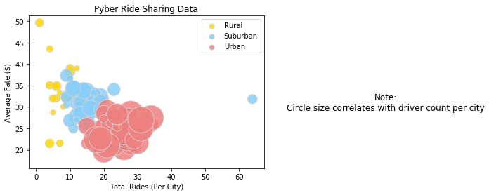
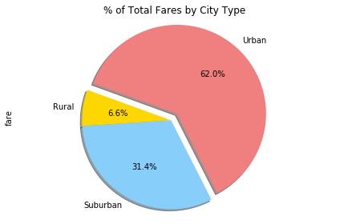
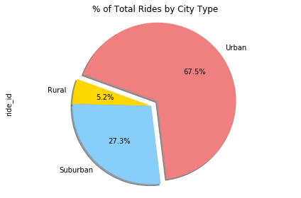
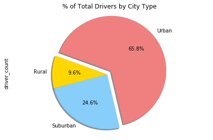

# Cyber Analysis

* The less rides that occur in the city usually mean higher fares. Fewer drivers also help the price upwards.
* Most of our rides occur in an urban environment
* Our Rural and Suburban services come at a higher average price
* We have less suburban drivers which are effective at generating fares than the rural or urban drivers


```python
import pandas as pd
import matplotlib.pyplot as plt
import seaborn as sns
import numpy
```


```python
city_raw = pd.read_csv("raw_data/city_data.csv")
ride_raw = pd.read_csv("raw_data/ride_data.csv")
```


```python
city_raw.head()
```


<div>
<style scoped>
    .dataframe tbody tr th:only-of-type {
        vertical-align: middle;
    }

    .dataframe tbody tr th {
        vertical-align: top;
    }

    .dataframe thead th {
        text-align: right;
    }
</style>
<table border="1" class="dataframe">
  <thead>
    <tr style="text-align: right;">
      <th></th>
      <th>city</th>
      <th>driver_count</th>
      <th>type</th>
    </tr>
  </thead>
  <tbody>
    <tr>
      <th>0</th>
      <td>Kelseyland</td>
      <td>63</td>
      <td>Urban</td>
    </tr>
    <tr>
      <th>1</th>
      <td>Nguyenbury</td>
      <td>8</td>
      <td>Urban</td>
    </tr>
    <tr>
      <th>2</th>
      <td>East Douglas</td>
      <td>12</td>
      <td>Urban</td>
    </tr>
    <tr>
      <th>3</th>
      <td>West Dawnfurt</td>
      <td>34</td>
      <td>Urban</td>
    </tr>
    <tr>
      <th>4</th>
      <td>Rodriguezburgh</td>
      <td>52</td>
      <td>Urban</td>
    </tr>
  </tbody>
</table>
</div>


```python
ride_raw.head()
```


<div>
<style scoped>
    .dataframe tbody tr th:only-of-type {
        vertical-align: middle;
    }

    .dataframe tbody tr th {
        vertical-align: top;
    }

    .dataframe thead th {
        text-align: right;
    }
</style>
<table border="1" class="dataframe">
  <thead>
    <tr style="text-align: right;">
      <th></th>
      <th>city</th>
      <th>date</th>
      <th>fare</th>
      <th>ride_id</th>
    </tr>
  </thead>
  <tbody>
    <tr>
      <th>0</th>
      <td>Sarabury</td>
      <td>2016-01-16 13:49:27</td>
      <td>38.35</td>
      <td>5403689035038</td>
    </tr>
    <tr>
      <th>1</th>
      <td>South Roy</td>
      <td>2016-01-02 18:42:34</td>
      <td>17.49</td>
      <td>4036272335942</td>
    </tr>
    <tr>
      <th>2</th>
      <td>Wiseborough</td>
      <td>2016-01-21 17:35:29</td>
      <td>44.18</td>
      <td>3645042422587</td>
    </tr>
    <tr>
      <th>3</th>
      <td>Spencertown</td>
      <td>2016-07-31 14:53:22</td>
      <td>6.87</td>
      <td>2242596575892</td>
    </tr>
    <tr>
      <th>4</th>
      <td>Nguyenbury</td>
      <td>2016-07-09 04:42:44</td>
      <td>6.28</td>
      <td>1543057793673</td>
    </tr>
  </tbody>
</table>
</div>


```python
merged = ride_raw.merge(city_raw, on= "city", how = "inner")
merged.head()
```


<div>
<style scoped>
    .dataframe tbody tr th:only-of-type {
        vertical-align: middle;
    }

    .dataframe tbody tr th {
        vertical-align: top;
    }

    .dataframe thead th {
        text-align: right;
    }
</style>
<table border="1" class="dataframe">
  <thead>
    <tr style="text-align: right;">
      <th></th>
      <th>city</th>
      <th>date</th>
      <th>fare</th>
      <th>ride_id</th>
      <th>driver_count</th>
      <th>type</th>
    </tr>
  </thead>
  <tbody>
    <tr>
      <th>0</th>
      <td>Sarabury</td>
      <td>2016-01-16 13:49:27</td>
      <td>38.35</td>
      <td>5403689035038</td>
      <td>46</td>
      <td>Urban</td>
    </tr>
    <tr>
      <th>1</th>
      <td>Sarabury</td>
      <td>2016-07-23 07:42:44</td>
      <td>21.76</td>
      <td>7546681945283</td>
      <td>46</td>
      <td>Urban</td>
    </tr>
    <tr>
      <th>2</th>
      <td>Sarabury</td>
      <td>2016-04-02 04:32:25</td>
      <td>38.03</td>
      <td>4932495851866</td>
      <td>46</td>
      <td>Urban</td>
    </tr>
    <tr>
      <th>3</th>
      <td>Sarabury</td>
      <td>2016-06-23 05:03:41</td>
      <td>26.82</td>
      <td>6711035373406</td>
      <td>46</td>
      <td>Urban</td>
    </tr>
    <tr>
      <th>4</th>
      <td>Sarabury</td>
      <td>2016-09-30 12:48:34</td>
      <td>30.30</td>
      <td>6388737278232</td>
      <td>46</td>
      <td>Urban</td>
    </tr>
  </tbody>
</table>
</div>


```python
# Toggle through to check the respective table's row count
# Not sure why there are extra rows after the inner merge
print(city_raw.count())
print(ride_raw.count())
print(merged.count())
```

    city            126
    driver_count    126
    type            126
    dtype: int64
    city       2375
    date       2375
    fare       2375
    ride_id    2375
    dtype: int64
    city            2407
    date            2407
    fare            2407
    ride_id         2407
    driver_count    2407
    type            2407
    dtype: int64
    


```python
farebycity = merged.groupby("city")["fare"].mean()
ridesbycity = merged.groupby("city")["ride_id"].count()
drivers = merged.groupby("city")["driver_count"].sum() / merged.groupby("city")["driver_count"].count()
citytypes = merged.groupby('type')["city"].count()
```

## Bubble Plot of Ride Sharing Data


```python
plt.subplot()
plt.title("Pyber Ride Sharing Data")
colors = ["Gold", "lightskyblue", "Lightcoral"]
typelist = [types for types in citytypes.index]
i = 0
for types in citytypes.index:
    mask = merged[merged["type"]==types]
    ridesbycity = ridesbycity = mask.groupby("city")["ride_id"].count()
    farebycity = mask.groupby("city")["fare"].mean()
    drivers = mask.groupby("city")["driver_count"].sum() / mask.groupby("city")["driver_count"].count()
    plt.scatter(x=ridesbycity,y=farebycity,s= drivers * 20, edgecolors="lightgray", alpha = .85, linewidths = 1, c= colors[i])
    i+=1

lgnd = plt.legend(labels = typelist)
#fixing the weird instance where the legend's markers are also "bubbled"
lgnd.legendHandles[0]._sizes = [50]
lgnd.legendHandles[1]._sizes = [50]
lgnd.legendHandles[2]._sizes = [50]
plt.suptitle("Note:\nCircle size correlates with driver count per city",x=1.3,y=.5)
plt.xlabel("Total Rides (Per City)")
plt.ylabel("Average Fate ($)")
```


    Text(0,0.5,'Average Fate ($)')





## Total Fares by City Type


```python
farebytype = merged.groupby("type")["fare"].sum()
explode = [0,0,0.1]
plt.title("% of Total Fares by City Type")
farebytype.plot.pie(startangle = 160, shadow = True, explode=explode, autopct="%1.1f%%", colors = colors)
plt.axis('equal')
plt.tight_layout()
plt.show()
```





## Total Rides by City Type


```python
ridesbytype = merged.groupby("type")["ride_id"].count()
explode = [0,0,0.1]
plt.title("% of Total Rides by City Type")
ridesbytype.plot.pie(startangle = 160, shadow = True, explode=explode, autopct="%1.1f%%", colors = colors)
plt.axis('equal')
plt.tight_layout()
plt.show()
```





## Total Drivers by City Type


```python
driversbytype = merged.groupby("type")["driver_count"].sum() / merged.groupby("type")["driver_count"].count()
explode = [0,0,0.1]
plt.title("% of Total Drivers by City Type")
driversbytype.plot.pie(startangle = 160, shadow = True, explode=explode, autopct="%1.1f%%", colors = colors)
plt.axis('equal')
plt.tight_layout()
plt.show()
```




